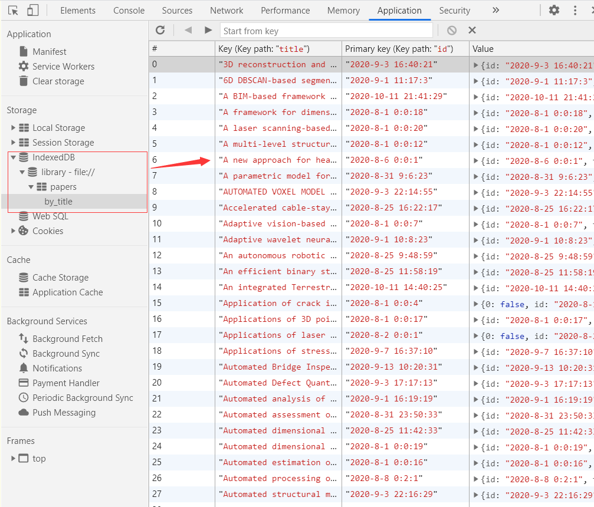

> ## :star: :star: :star: :star: :star:
> ## Now, this page is avaiable in [paper_tool](https://subce.gitee.io/htmls/slide_news/slide1/paperdisp.html) 
> ## Operation
> ## Select **Docs** ---> **Open** ---> **"select a \*.bib file such as created by mendeley"**
> ## Note the online page is only to show paper list in \*.bib depend on mendeley. You can also use the local version in this depository. But, the depository will be not updated!

### An app to manage papers based on web

#### 1. Dependencies

* bootstrap
* bootstrap-table
* echarts
* showdown
* tableExport

#### 2. functions

* global

  

* Card View

  

* add paper

  

  support .enw .ris .bib currently

* control panel

  * set color
  * import json
  * field search

  

* paper Statistics

  **Waiting to be added**

  

* Local database（IndexedDB)

  

* Notes

  support for markdown

  waiting to support Latex
  
  
  

  see notes

  

* Install

  Just download and open paper_indexedDB.html.
